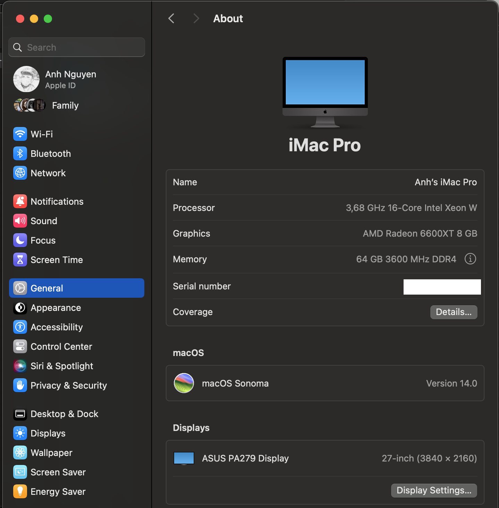
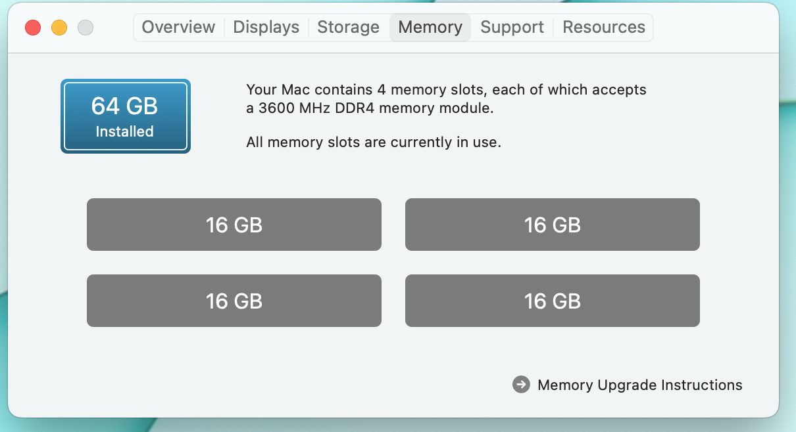
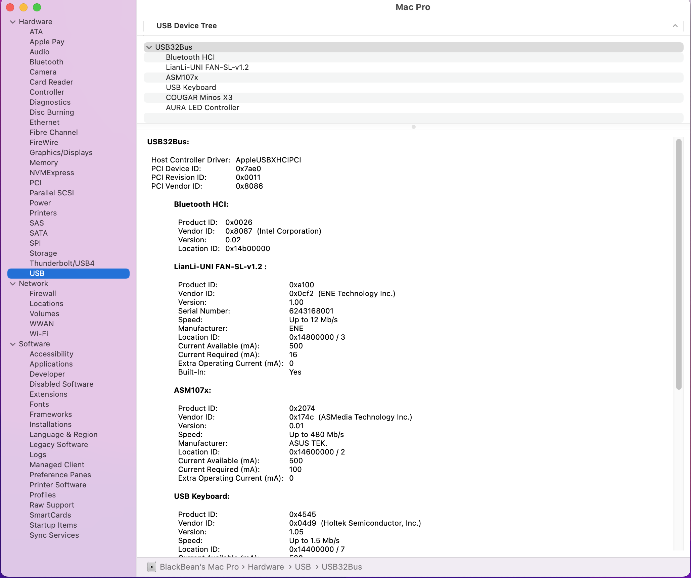

# Build my Hackintosh EFI
- Z690 Chipset and Alder Lake CPUs

## Changelog

-----
#### Mac OS 12 (Monterey)

0.0.1 - initial release

0.0.2 - update opencore 0.8.1 release

#### Mac OS 13 (Ventura)

0.1.0 - update opencore 0.8.5 release

## Hardware Spec
- Asus tuf gaming z690-plus wifi d4
- Intel® Core™ i5-12600K
- Dual Radeon™ RX 6600 XT OC Edition
- Fenvi-T919-802.11ac 2.4G-5GHz BCM94360CD
- Corsair Vengeance RS Pro RGB 64Gb
- SSD Samsung 980 Pro PCIe Gen 4.0 x4 NVMe V-NAND M.2 2280 500GB MZ-V8P500BW
- SSD WD Black SN850 PCIe Gen4 x4 NVMe M.2 1TB WDS100T1X0E
- Lian Li Galahad AIO 240 GA240A White
- Monitor ASUS ProArt 27" 4K
- ......

## BIOS Config
 - enable X.M.P
 - Fast Boot - off
 - VT-d - off
 - CSM - off
 - VT-x - on
 - Above 4G decoding - on
 - Re-Size BAR Support - on
 - XHCI Hand-off - on
 - Serial port - off
 - iGPU Multi Monitor - off
 - Memory Remap - on
 
## Work
- restart
- sleep
- Wi-Fi Dual card (on Broad && extent card)
- Bluetooth - extent card
- all usb ports
- sound card
- Display port with sound
- HDMI with sound
- 4K display with ASUS ProArt 27"
- Imessage/Facetime
- Unlock with apple watch
- Universal control 
- AirDrop
- etc....
## Not Work 
- Bluetooth on broad
- ....

## Some images

refer for my work [here](https://www.reddit.com/r/hackintosh/comments/sp1zgv/opencore_alder_lake_12thgen_intel_hackintosh/)
